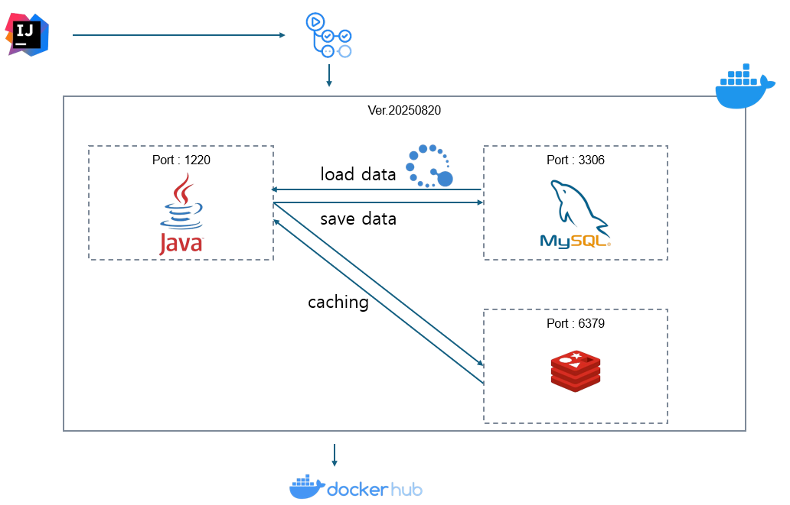

# 투둥탁
장기 프로젝트의 task를 달력에 일 단위로 쪼개서 todo로 작성하고 일기로 하루를 마무리해요.  

#### 개발 배경  

###### 시간
시간은 누구에게나 공평하게 주어지지만,  
어떻게 활용하느냐에 따라 사람이 달라진다고 생각하고 있습니다.    
 
연·월·일 단위로 쪼갤 수 있는 시간 속에서  
결국 가장 중요한 것은 "오늘 무엇을 할 것인가"입니다.  
 
이를 위해 투둥탁은 장기 프로젝트나 루틴을 기록하고  
하루를 시작할 때 todo로 계획을 세우고,  
하루가 끝날 때 일기로 기록하며 하루를 완성하는 SW입니다.

###### 기술
한번 즘 프레임워크를 안쓰고 알고리즘 최적화, 디자인패턴 설계, 시큐어 코딩을 해봄으로써  
후에 개발자 본연의 실력을 높여서 새로운 언어나 프레임워크를 사용했을 때 러닝 커브를 줄이고 싶었습니다.

---

### 설계

###### system architecture
  